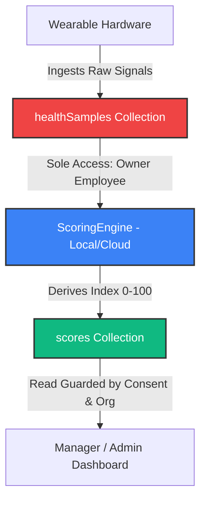

# BurnoutMeter — B2B Multi-Tenant Wellness SaaS Platform

[](https://github.com/zepolnala/burnout_meter/actions)
[](#-zero-trust-firestore-security-matrix)
[](#-observability-telemetry--crash-reporting)
[](#)

BurnoutMeter is a state-of-the-art enterprise B2B wellness platform built with **Flutter and Firebase**. It enables early detection of employee psychophysiological load and burnout risk using wearable data (biometrics like heart rate, heart rate variability, respiration, and sleep duration) **strictly under GDPR-enforced Privacy-by-Design bounds**.

This repository is a production-ready, clean-architecture showcase designed specifically to be audited by a CTO, Lead Architect, or Technical Reviewer.

---

## 🏛️ System Vision & Product Architecture

In high-stress corporate environments, organizations need indicators to support employee mental health before overexposure leads to clinical burnout. However, standard wellness apps require employees to surrender highly sensitive health signals to their employers.

BurnoutMeter resolves this dilemma by separating **raw signals** from **business metrics** via cryptographic/server-enforced security boundaries:



### Clean Architecture Layers
The project enforces a strict, unidirectional dependency layout (`presentation ➔ domain 🡠 data`):
*   **`domain/`** (Value objects, Entity models, Use cases): Contains pure business logic. Completely decoupled from external frameworks like Firebase or Flutter.
*   **`data/`** (DTOs, Repositories, SQLite Drift): Manages data retrieval, SQLite persistence, and Firestore sync.
*   **`presentation/`** (Riverpod Providers, Routing, UI Shells): Contains platform-responsive widgets subdivided by role dashboards.

---

## 🚀 The 3-Minute Executive Demo Journey

To experience the zero-trust privacy engine and GDPR-enforced states reactively in under three minutes, follow this developer flow:

### 1. Boot up the Local Emulator Sandbox
Ensure the secure local Firebase Emulator suite (Auth, Firestore, Consoles) is active:
```bash
# Set up executable permission and launch
chmod +x scripts/run_emulators.sh
./scripts/run_emulators.sh
```

### 2. Boot the Client
Run the application on your target platform (Web or Mobile):
*   *Telemetry note:* The bright header banner displays **`[EMULADOR LOCAL ACTIVE]`** to show that all operations are isolated in your sandboxed emulator.

### 3. Bootstrap the Database (Seed)
On the Login screen, click **"Inicializar DB Local (Seed)"**. Under the hood, this executes the idempotent Dart `SeedService` to populate mock organization `org789`, teams (`teamEng`, `teamCS`),FirebaseAuth mock profiles, and privacy consent templates.

### 4. Step-by-Step GDPR Interactive Verification:
*   **Step A (Log in as Employee - Alan):** Choose **Alan** (`employee_eng1@burnoutmeter.demo`).
    *   Click **"Simular Lectura Wearable"**. Under the hood, this loads historical biometric records from the replay JSON fixture, processes them through the `ScoringEngine` equations, saves the derived index, and reactively updates the dashboard gauges!
*   **Step B (Log in as Manager - Victor):** Sign out, and log in as team lead **Victor** (`manager_eng@burnoutmeter.demo`).
    *   Review Victor's dashboard: **Alan's card** is fully visible displaying his score (`32.0`) and aggregated sleep/stress chart lines.
    *   Review **Sofía Martín's card**: Her card displays **`🔒 Privado`** and hides all metrics because she has opted out of consent sharing.
*   **Step C (GDPR Real-Time Enforcement):** Sign out, log back in as **Sofía** (`employee_eng2@burnoutmeter.demo`), navigate to the "Privacidad" tab, and toggle **"Compartir mi score con mi organización"** to **Active**. Log back in as Victor: Her score is now **instantly visible and aggregated** in real-time!
*   **Step D (Immutable Security Ledger):** Sign out and enter as **Admin** (`admin@burnoutmeter.demo`). Go to the **Audit Log** section to consult the permanent security ledger: every single query, consent toggle, and manager read is listed in an unalterable record that Firestore rules prevent any actor from deleting.

---

## 🛡️ Zero-Trust Firestore Security Matrix

The core security rules inside [firestore.rules](file:///Users/alan/Burnout%20meter/firestore.rules) represent the absolute truth of our B2B tenant isolation and data boundaries. 

Our compliance model guarantees:

| Collection Path | Role: Employee (Owner) | Role: Manager (Team Lead) | Role: Organization Admin | Rationale |
| :--- | :--- | :--- | :--- | :--- |
| `/healthSamples/{id}` | **Read & Write** | 🚫 **DENIED** | 🚫 **DENIED** | **Separation of Concerns:** Raw biometrics are strictly private. No manager or admin can query raw signals under any consent policy. |
| `/scores/{id}` | **Read & Write** | **Read (Consent Bound)** | **Read (Tenant Bound)** | **Aaggregated Visibility:** Managers can read only if employee belongs to their managed team AND `consent.sharingEnabled == true`. |
| `/consents/{id}` | **Read & Write** | 🚫 **Read Only** | 🚫 **Read Only** | **GDPR Compliance:** Only the employee is authorized to toggle their privacy settings. |
| `/audit_logs/{id}` | 🚫 **Write Only** | 🚫 **Write Only** | **Read Only (Org Bound)** | **Security Ledger:** Immutable ledger entries. Rules prohibit `update` or `delete` by any user. |
| `/seed_status/{id}` | **Read Only** | **Read Only** | **Read & Write (Auth Bound)**| **Hardened Bootstrap:** Protected from anonymous writes to avoid Denial of Service database resets. |

---

## 🔑 Developer & Evaluator Credentials

All seeded accounts share the standard password: **`password123`**

| Role | Developer Email | Seed Profile Name | Purpose |
| :--- | :--- | :--- | :--- |
| **Employee** | `employee_eng1@burnoutmeter.demo` | Alan | Consenting employee. Triggers wearable biometrics replay. |
| **Employee** | `employee_eng2@burnoutmeter.demo` | Sofía Martín | Privacy-first employee (Consent sharing initially disabled). |
| **Manager** | `manager_eng@burnoutmeter.demo` | Victor | Team Lead managing `teamEng`. Reviews aggregates and triggers wellness actions. |
| **Admin** | `admin@burnoutmeter.demo` | Global Admin | B2B Tenant Auditor. Consults immutable access log histories. |

---

## 🧪 Automated Testing & Verification Gates

BurnoutMeter does not report success without real, end-to-end mathematical verification:

```bash
# 1. Verify Firestore Zero-Trust Rules (via local Firebase emulator lifecycle)
chmod +x scripts/run_emulator_tests.sh
./scripts/run_emulator_tests.sh

# 2. Run Dart Unit & Scoring Engine tests
flutter test

# 3. Perform static lint analyzer review
flutter analyze

# 4. Compile stable production Web release
flutter build web --release
```

---

## 📊 Observability, Telemetry & Crash Reporting

This Release Candidate incorporates production-grade observability:
*   **Firebase Crashlytics:** Enabled in release compiles. Platform-safe setup ensures web and mobile clients initialize cleanly. Debug and emulator runs are kept silent to prevent sandbox data pollution.
*   **Global Uncaught Exception Boundaries:** Uncaught Flutter widget exceptions and asynchronous platform dispatcher failures are caught globally and uploaded as fatal crash reports.
*   **Riverpod State Telemetry:** The customized `AppProviderObserver` tracks Riverpod state lifecycles and records provider failures directly to Crashlytics as non-fatal events.
*   **Breadcrumb Mirroring:** The standard `AppLogger` intercepts console outputs (`🚀 [STARTUP]`, `🔐 [AUTH]`, `🛡️ [GDPR_CONSENT]`, `🧮 [SCORING]`) and appends them to Crashlytics breadcrumbs for robust troubleshooting.

---

## 📋 Comprehensive Technical Documentation Index

For detailed explanations of our architecture decisions, algorithms, and technical depth:

*   [docs/architecture.md](file:///Users/alan/Burnout%20meter/docs/architecture.md) — Flutter multi-shell patterns, Riverpod caching, and routing details.
*   [docs/security-model.md](file:///Users/alan/Burnout%20meter/docs/security-model.md) — Complete rules matrices, tenant isolation, and GDPR opt-in designs.
*   [docs/data-flow.md](file:///Users/alan/Burnout%20meter/docs/data-flow.md) — Diagrams of the scoring and aggregation pipelines.
*   [docs/tradeoffs.md](file:///Users/alan/Burnout%20meter/docs/tradeoffs.md) — Architectural tradeoffs made for the B2B MVP (client score calculations vs. production cloud functions).
*   [docs/technical-debt.md](file:///Users/alan/Burnout%20meter/docs/technical-debt.md) — Registry of accepted debt and future refactoring tasks.
*   [docs/engineering_audit.md](file:///Users/alan/Burnout%20meter/docs/engineering_audit.md) — Full technical audit detailing previous E2E chrome viewports resolutions, linter cleanups, and rule hardening steps.
*   [docs/demo-guide.md](file:///Users/alan/Burnout%20meter/docs/demo-guide.md) — Detailed live demonstration scripts.
*   [docs/troubleshooting.md](file:///Users/alan/Burnout%20meter/docs/troubleshooting.md) — Solutions to developer friction points (port blocks, emulator hangs, drift clears).
*   [docs/release-checklist.md](file:///Users/alan/Burnout%20meter/docs/release-checklist.md) — Release candidate readiness gate definitions.
