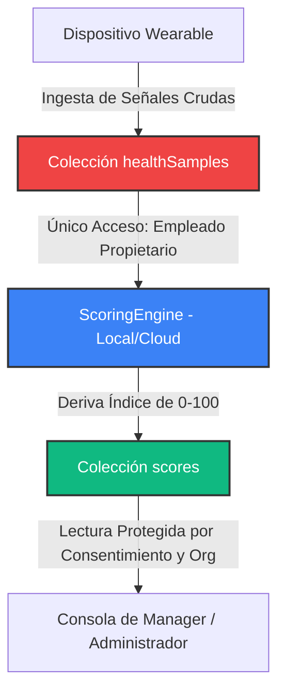

# BurnoutMeter — Plataforma SaaS B2B de Bienestar Multi-Inquilino (Multi-Tenant)

[](https://github.com/zepolnala/burnout_meter/actions)
[](#-matriz-de-seguridad-zero-trust-de-firestore)
[](#-observabilidad-telemetr%C3%ADa-y-reporte-de-fallos)
[](#)

BurnoutMeter es una plataforma de bienestar B2B corporativa de última generación desarrollada con **Flutter y Firebase**. Permite la detección temprana de la carga psicofisiológica y el riesgo de burnout en empleados utilizando datos de wearables (métricas biométricas como frecuencia cardíaca, variabilidad del ritmo cardíaco - HRV, frecuencia respiratoria y duración del sueño) **bajo límites de Privacidad por Diseño (Privacy-by-Design) estrictamente regulados por el GDPR**.

Este repositorio es una vitrina de arquitectura limpia (Clean Architecture), lista para producción, diseñada específicamente para ser auditada por un CTO, Arquitecto Líder o Revisor Técnico.

---

## 🏛️ Visión del Sistema y Arquitectura del Producto

En entornos corporativos de alto estrés, las organizaciones necesitan indicadores para apoyar la salud mental de los empleados antes de que la sobreexposición provoque un burnout clínico. Sin embargo, las aplicaciones de bienestar tradicionales exigen que los empleados entreguen datos de salud altamente sensibles a sus empleadores.

BurnoutMeter resuelve este dilema separando las **señales biológicas crudas** de las **métricas de negocio** mediante fronteras de seguridad criptográficas y aplicadas directamente en el servidor (Firestore Security Rules):



### Capas de Arquitectura Limpia (Clean Architecture)
El proyecto implementa un diseño estricto de dependencias unidireccionales (`presentación ➔ dominio 🡠 datos`):
*   **`domain/`** (Objetos de valor, Modelos de Entidad, Casos de uso): Contiene la lógica de negocio pura. Totalmente desacoplada de frameworks externos como Firebase o Flutter.
*   **`data/`** (DTOs, Repositorios, Drift SQLite): Gestiona la obtención de datos, la persistencia en base de datos local SQLite y la sincronización con Firestore.
*   **`presentation/`** (Riverpod Providers, Enrutamiento, Shells de UI): Contiene widgets responsivos subdivididos por consolas específicas de roles.

---

## 🚀 El Recorrido de Demostración Ejecutiva en 3 Minutos

Para experimentar el motor de privacidad zero-trust y los estados de consentimiento del GDPR en tiempo real y en menos de tres minutos, sigue este flujo de desarrollo:

### 1. Iniciar el Sandbox del Emulador Local
Asegúrate de que la suite del emulador local de Firebase (Auth, Firestore, Consolas) esté activa y configurada de forma segura:
```bash
# Otorgar permisos de ejecución e iniciar
chmod +x scripts/run_emulators.sh
./scripts/run_emulators.sh
```

### 2. Iniciar el Cliente
Ejecuta la aplicación en la plataforma que prefieras (Web o Móvil):
*   *Nota de telemetría:* La barra de estado superior de la cabecera muestra dinámicamente un indicador en color verde **`[NUBE FIREBASE]`** si se conecta a los servicios reales de Firebase Cloud en producción, o una insignia en color amarillo **`[EMULADOR LOCAL]`** para denotar el aislamiento seguro de pruebas locales.

### 3. Inicializar la Base de Datos (Seed)
En la pantalla de inicio de sesión, haz clic en **"Inicializar DB Local (Seed)"**. Internamente, esto ejecuta la clase idempotente en Dart `SeedService` para poblar la organización `org789`, equipos (`teamEng`, `teamCS`), perfiles demo en FirebaseAuth y plantillas de consentimiento de privacidad.

### 4. Verificación Interactiva Paso a Paso del GDPR:
*   **Paso A (Ingresar como Empleado - Alan):** Selecciona a **Alan** (`employee_eng1@burnoutmeter.demo`).
    *   Haz clic en **"Simular Lectura Wearable"**. Internamente, la app genera de forma aleatoria nuevos datos fisiológicos mediante el `SyntheticHealthDataSource` (sueño, pulso, HRV, respiración), los procesa a través del `ScoringEngine` clínico, almacena el score resultante y actualiza los diales e indicadores de forma reactiva y en tiempo real.
*   **Paso B (Ingresar como Manager - Victor):** Cierra sesión e ingresa como el líder del equipo **Victor** (`manager_eng@burnoutmeter.demo`).
    *   Revisa la consola de Victor: la **tarjeta de Alan** es completamente visible, mostrando su score (`32.0`) y las gráficas de desglose del sueño y estrés.
    *   Revisa la **tarjeta de Sofía Martín**: se despliega como **`🔒 Privado`** y oculta todas sus métricas fisiológicas porque ha revocado el consentimiento de compartir información.
*   **Paso C (Privacidad GDPR en Tiempo Real):** Cierra sesión, ingresa como **Sofía** (`employee_eng2@burnoutmeter.demo`), ve a la pestaña "Privacidad", y activa **"Compartir mi score con mi organización"**. Vuelve a ingresar como Victor: su puntuación es ahora **instantáneamente visible y agregada** en tiempo real.
*   **Paso D (Libro de Auditoría Inmutable):** Cierra sesión e ingresa como **Admin** (`admin@burnoutmeter.demo`). Ve a la sección **Audit Log** para consultar el historial de auditoría de accesos: cada consulta, cambio de consentimiento o lectura de manager se registra en un registro permanente que las reglas de seguridad de Firestore impiden que cualquier usuario edite o elimine.

---

## 🛡️ Matriz de Seguridad Zero-Trust de Firestore

Las reglas de seguridad núcleo descritas en [firestore.rules](file:///Users/alan/Burnout%20meter/firestore.rules) representan la verdad absoluta del aislamiento de inquilinos B2B y las fronteras de datos.

Nuestro modelo de cumplimiento garantiza:

| Ruta de Colección | Rol: Empleado (Propietario) | Rol: Manager (Líder de Equipo) | Rol: Administrador de Org | Justificación Técnica |
| :--- | :--- | :--- | :--- | :--- |
| `/healthSamples/{id}` | **Lectura y Escritura** | 🚫 **DENEGADO** | 🚫 **DENEGADO** | **Separación de Responsabilidades:** La biometría cruda es estrictamente privada. Ningún manager ni administrador puede consultar señales biológicas crudas bajo ninguna política. |
| `/scores/{id}` | **Lectura y Escritura** | **Lectura (Bajo Consentimiento)** | **Lectura (Frontera de Inquilino)** | **Visibilidad Agregada:** Los managers leen puntajes únicamente si el empleado pertenece a su equipo Y `consent.sharingEnabled == true`. |
| `/consents/{id}` | **Lectura y Escritura** | 🚫 **Solo Lectura** | 🚫 **Solo Lectura** | **Cumplimiento GDPR:** Solo el propio empleado está autorizado para alternar sus configuraciones de privacidad y consentimiento. |
| `/audit_logs/{id}` | 🚫 **Solo Escritura** | 🚫 **Solo Escritura** | **Solo Lectura (Frontera Org)** | **Registro de Seguridad:** Entradas inmutables para cumplir con GDPR. Las reglas prohíben la edición (`update`) o eliminación (`delete`) para todos los actores. |
| `/seed_status/{id}` | **Solo Lectura** | **Solo Lectura** | **Lectura y Escritura (Auth)** | **Inicialización Blindada:** Protegido de escrituras anónimas para evitar denegación de servicio (DoS) por reinicio de datos en producción. |

---

## 🔑 Credenciales de Desarrollador y Evaluador

Todas las cuentas demo inicializadas comparten la contraseña estándar: **`password123`**

| Rol Corporativo | Correo Electrónico Demo | Nombre de Perfil Sembrado | Propósito de la Demostración |
| :--- | :--- | :--- | :--- |
| **Empleado** | `employee_eng1@burnoutmeter.demo` | Alan | Empleado con consentimiento activo. Simula biometría aleatoria en tiempo real. |
| **Empleado** | `employee_eng2@burnoutmeter.demo` | Sofía Martín | Empleado con privacidad estricta (Compartir desactivado inicialmente). |
| **Manager** | `manager_eng@burnoutmeter.demo` | Victor | Líder de equipo de `teamEng`. Revisa métricas y ejecuta acciones de bienestar. |
| **Administrador** | `admin@burnoutmeter.demo` | Administrador Global | Auditor de Inquilino B2B. Consulta el historial inmutable del log de auditoría. |

---

## 🧪 Pruebas Automatizadas y Puertas de Verificación

BurnoutMeter no declara éxito sin una verificación matemática y de seguridad de extremo a extremo real:

```bash
# 1. Verificar Reglas Zero-Trust de Firestore (vía ciclo de vida de emuladores locales)
chmod +x scripts/run_emulator_tests.sh
./scripts/run_emulator_tests.sh

# 2. Ejecutar Pruebas Unitarias de Dart y del ScoringEngine
flutter test

# 3. Realizar análisis de linter y estática de código
flutter analyze

# 4. Compilar distribución de producción Web estable
flutter build web --release
```

---

## 📊 Observability, Telemetría y Reporte de Fallos

Esta versión definitiva incorpora observabilidad de grado de producción:
*   **Firebase Crashlytics:** Habilitado de forma segura en las compilaciones de producción (Release). El diseño seguro de la plataforma evita fallos de inicialización tanto en web como en dispositivos móviles, y se mantiene silencioso en desarrollo y en emuladores para evitar ruido en el sandbox.
*   **Manejo Global de Excepciones No Capturadas:** Las fallas de renderizado de widgets de Flutter y los errores asíncronos nativos se capturan a nivel global y se reportan de forma fatal.
*   **Monitoreo de Estado con Riverpod:** Se implementó un observador personalizado `AppProviderObserver` que monitorea el ciclo de vida de los providers y reporta directamente excepciones internas a Crashlytics como eventos no fatales.
*   **Huellas de Diagnóstico (Breadcrumbs):** El logger estándar `AppLogger` intercepta los flujos del sistema (`🚀 [STARTUP]`, `🔐 [AUTH]`, `🛡️ [GDPR_CONSENT]`, `🧮 [SCORING]`) y los inyecta en el historial de logs de Crashlytics como migas de pan clave para auditorías y debugging.

---

## 📋 Índice de Documentación Técnica Completa

Para profundizar en el diseño, la lógica matemática, los tradeoffs y la arquitectura:

*   [docs/architecture.md](file:///Users/alan/Burnout%20meter/docs/architecture.md) — Patrones de shells responsivas en Flutter, estados Riverpod y ruteo.
*   [docs/security-model.md](file:///Users/alan/Burnout%20meter/docs/security-model.md) — Matriz completa de reglas, diseño de multi-tenancy y consentimiento.
*   [docs/data-flow.md](file:///Users/alan/Burnout%20meter/docs/data-flow.md) — Flujos visuales de datos fisiológicos y pipelines de agregación.
*   [docs/tradeoffs.md](file:///Users/alan/Burnout%20meter/docs/tradeoffs.md) — Compromisos de arquitectura (cálculos en cliente vs. Functions en la nube).
*   [docs/technical-debt.md](file:///Users/alan/Burnout%20meter/docs/technical-debt.md) — Registro de deuda técnica aceptada y planes de refactorización.
*   [docs/engineering_audit.md](file:///Users/alan/Burnout%20meter/docs/engineering_audit.md) — Auditoría técnica detallada sobre resoluciones de ChromeDriver, linter y endurecimiento de reglas.
*   [docs/demo-guide.md](file:///Users/alan/Burnout%20meter/docs/demo-guide.md) — Scripts de demostración interactiva detallada.
*   [docs/troubleshooting.md](file:///Users/alan/Burnout%20meter/docs/troubleshooting.md) — Solución a fallos de puertos ocupados, cuelgues del emulador o limpiezas de Drift SQLite.
*   [docs/release-checklist.md](file:///Users/alan/Burnout%20meter/docs/release-checklist.md) — Checklist de verificación de calidad para el Release Candidate.
