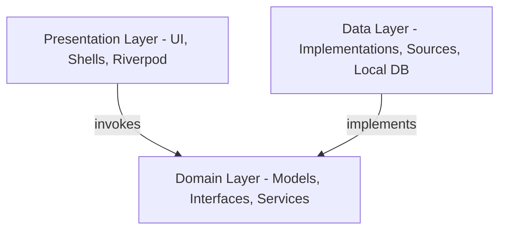

# Architectural Blueprint & Design Patterns

This document details the software design, code layout, and system architecture for the **BurnoutMeter** class-representative B2B multi-tenant platform.

---

## 🏛️ The Clean Architecture Paradigm

BurnoutMeter is structured according to **Clean Architecture** patterns, separating enterprise business rules, application-specific logic, and infrastructure adapters:

### 1. Domain Layer (`lib/domain/`)
The foundational layer of the application containing pure Dart contracts and models, with absolutely zero external framework dependencies:
* **Models**: Entities like `Score`, `HealthSample`, `Membership`, `Consent`, and `ActionInstance` compiled using immutable generated classes.
* **Interfaces / Repositories**: Pure contracts outlining the exact operations allowed on data collections (e.g. `HealthRepository`, `ConsentRepository`).
* **Services**: The clinical calculation engine (`ScoringEngine`) determining physiological scores from raw samples.

### 2. Data Layer (`lib/data/`)
Bridges the abstract domain rules with low-level databases, network connections, and data sources:
* **Repositories**: Concrete class implementations of domain interfaces (e.g., `FirestoreRepositories` matching `lib/domain/repositories/`).
* **Sources**: Connectors fetching raw physiological files from standard JSON fixtures (`ReplayHealthDataSource`).

### 3. Presentation Layer (`lib/presentation/`)
Responsible for drawing responsive HSL layout boundaries and feeding them reactive streams:
* **Shells**: The dedicated, isolated desktop/mobile frames (Employee, Manager, Admin) that partition visual interfaces according to Roles.
* **Providers (`lib/shared/providers/`)**: Riverpod state providers that bind business states to UI updates, listening to dynamic streams.

---

## ⚡ Framework Rationale

### Why Flutter?
* **Single Master Codebase**: Compiles natively to both high-performance Web and Mobile layout shells, allowing startup B2B teams to test multi-device portfolios without keeping duplicate developer organizations.
* **Consistent Design Delivery**: Overcomes browser default differences by rendering directly on Canvas, allowing glassmorphism and HSL styling to look premium on every device size.

### Why Riverpod?
* **Completely Compile-Safe**: Unlike traditional InheritedWidgets, Riverpod resolves all providers at compile-time, eliminating runtime lookup crashes.
* **Reactive Cache Discard**: Provides clean cache invalidation hooks (e.g., `ref.invalidate()`), making biometrics recalculation and instant score rendering completely friction-free.

### Why GoRouter?
* **Declarative Guards**: Restricts dashboard locations based on active Claims, blocking bad route requests before the view can even instantiate.
