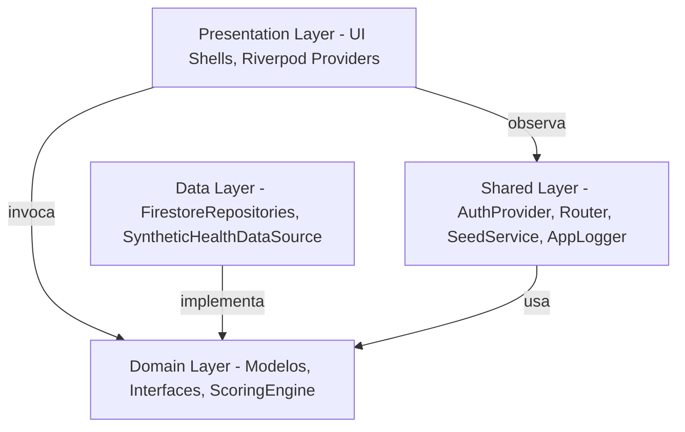

# Architectural Blueprint & Design Patterns

Este documento describe el diseño de software, la organización del código y la arquitectura de sistema de la plataforma **BurnoutMeter B2B Multi-Tenant**.

**Última actualización:** Mayo 2026

---

## 🏛️ El Paradigma de Clean Architecture

BurnoutMeter está estructurado según los patrones de **Clean Architecture**, separando reglas de negocio empresariales, lógica específica de la aplicación y adaptadores de infraestructura:



---

## 📁 Estructura de Directorios Actual

```
lib/
├── main.dart                         # Bootstrap + Firebase init + Emulator config
├── domain/
│   ├── models/                       # Entidades Freezed (Score, Membership, Consent, etc.)
│   │   ├── score.dart               # Score + Subscores (burnoutIndex, sleep, recovery, stress, load)
│   │   ├── membership.dart          # Membership (userId, orgId, teamId, role, managedTeamIds)
│   │   ├── consent.dart             # Consent (sharingEnabled, actionsEnabled)
│   │   ├── health_sample.dart       # HealthSample (type, value, timestamp, deviceSource)
│   │   ├── action.dart              # ActionInstance + ActionTemplate
│   │   └── audit_log.dart           # AuditLog (GDPR compliance trace)
│   ├── repositories/                # Contratos abstractos (interfaces)
│   └── services/
│       └── scoring_engine.dart      # Motor de cálculo fisiológico (puro Dart, sin dependencias)
├── data/
│   ├── repositories/
│   │   ├── firestore_repositories.dart   # Implementaciones Firestore de todos los repos
│   │   └── mock_repositories.dart        # Implementaciones en memoria (para tests)
│   ├── sources/health/
│   │   └── synthetic_health_data_source.dart  # Generador determinístico de biometría simulada
│   └── local/                        # Drift/SQLite (preparado, sin uso activo en MVP)
├── presentation/
│   ├── employee/
│   │   └── employee_shell.dart       # Dashboard Empleado (~40KB, vista principal)
│   ├── manager/
│   │   └── manager_shell.dart        # Dashboard Manager (~32KB, vista de equipo)
│   ├── admin/
│   │   └── admin_shell.dart          # Dashboard Admin (~19KB, vista multi-org)
│   └── shared/
│       ├── login_screen.dart         # Pantalla login/registro con seeding UI (~39KB)
│       ├── onboarding_dialog.dart    # Modal informativo (se muestra en primer login)
│       ├── app_shell.dart            # Swapper Console (selector de rol para demos)
│       ├── burnout_radial_score.dart # Widget de score circular reutilizable
│       └── vector_icons.dart         # Iconos SVG customizados
└── shared/
    ├── providers/
    │   ├── auth_provider.dart         # AuthNotifier + authStateProvider
    │   ├── burnout_providers.dart     # personalScoreProvider, teamScoresProvider, consentProvider, etc.
    │   └── repository_providers.dart  # Binding Riverpod de repositorios concretos
    ├── routing/
    │   └── app_router.dart            # GoRouter + GoRouterRefreshNotifier + RouterLogs
    ├── config/
    │   └── seed_service.dart          # SeedService: siembra Auth + Firestore idempotentemente
    ├── logging/
    │   └── app_logger.dart            # AppLogger: wrapper sobre print() con niveles
    └── theme/
        └── app_theme.dart             # AppTheme: dark/light themes, glassmorphism
```

---

## 🔑 Capa 1: Domain (`lib/domain/`)

La capa fundacional. Contiene contratos Dart puros sin dependencias externas.

- **Modelos**: Entidades inmutables generadas con `freezed` + `json_serializable`. Los archivos `.freezed.dart` y `.g.dart` son auto-generados mediante `build_runner`.
- **Interfaces/Repositorios**: Contratos abstractos que definen las operaciones permitidas sobre colecciones de datos (e.g., `HealthRepository`, `ConsentRepository`).
- **ScoringEngine**: Motor de cálculo clínico. Combina métricas HRV, sueño, respiración y pulso cardíaco en un **Índice de Burnout 0-100**. Completamente aislado de Flutter — puede compilarse en Dart puro y ejecutarse en un worker serverless.

---

## 🔑 Capa 2: Data (`lib/data/`)

Conecta los contratos de dominio con las fuentes de datos reales.

### FirestoreRepositories (`firestore_repositories.dart`)
Implementaciones concretas de todos los repositorios de dominio usando Firebase SDK:
- `FirestoreMembershipRepository` — gestiona membresías de usuarios y equipos
- `FirestoreHealthRepository` — guarda/recupera muestras biométricas y scores
- `FirestoreConsentRepository` — gestiona y observa consentimientos GDPR en tiempo real
- `FirestoreActionRepository` — envía/lee intervenciones de bienestar con streams reactivos
- `FirestoreAuditRepository` — escribe y lee el registro GDPR de audit trail

### SyntheticHealthDataSource
Genera datos biométricos determinísticos por UID para simular lecturas de wearable durante el MVP. Reemplaza el antiguo `ReplayHealthDataSource` estático.

---

## 🔑 Capa 3: Presentation (`lib/presentation/`)

Tres Shells independientes, aislados por rol:

| Shell | Ruta | Rol | Tamaño |
|---|---|---|---|
| `EmployeeShell` | `/employee` | employee | ~40KB |
| `ManagerShell` | `/manager` | manager | ~32KB |
| `AdminShell` | `/admin` | admin | ~19KB |
| `LoginScreen` | `/login` | público | ~39KB |

El shell apropiado se selecciona mediante el sistema de redirección de GoRouter en función del `role` del `Membership` activo en Firestore.

**OnboardingDialog**: Modal informativo que aparece tras el primer login de cada usuario, explicando el funcionamiento de la app. Actualmente se muestra siempre (comportamiento de MVP/demo).

---

## 🔑 Capa Shared (`lib/shared/`)

### AuthProvider (`auth_provider.dart`)
`AuthNotifier` extiende `StateNotifier<AsyncValue<Membership?>>`:
1. Se suscribe a `FirebaseAuth.authStateChanges()`.
2. Si hay sesión activa, abre un stream reactivo de Firestore en `/memberships/{uid}`.
3. El `Membership` resultante (con el `role` del usuario) alimenta al router para la redirección automática.

### Routing (`app_router.dart`)
Implementación actual del router con dos clases auxiliares:

```dart
// Puente entre Riverpod y GoRouter
class GoRouterRefreshNotifier extends ChangeNotifier {
  GoRouterRefreshNotifier(Ref ref) {
    ref.listen(authStateProvider, (_, __) => notifyListeners());
  }
}

// Log de rutas para diagnóstico de E2E tests (debugging)
class RouterLogs {
  static final List<String> logs = [];
}
```

**Nota técnica**: El router usa `refreshListenable: GoRouterRefreshNotifier(ref)` en lugar de `ref.watch()` para evitar la recreación del GoRouter en cada cambio de estado. La lógica de redirección lee el estado con `ref.read()` dentro del callback de `redirect`.

> ⚠️ **Bug conocido**: Las secciones de RBAC Guards (líneas 69-84 del router) están actualmente inalcanzables (dead code) debido a un `return null` prematuro en línea 67. Las guardias de roles están efectivamente deshabilitadas para la demo.

### SeedService (`seed_service.dart`)
Siembra idempotente de usuarios, membresías, consentimientos y scores iniciales en el emulador de Firebase. Incluye 6 usuarios demo:
- 1 Admin (`adm789`)
- 2 Managers (`mgrEng`, `mgrCS`)
- 3 Employees (`emp123` Alan, `empEng2` Sofía, `empCS1` Tomás)

El estado de siembra se persiste en Firestore en `/seed_status/seeded` para que la UI muestre el chip "REALIZADO".

---

## ⚡ Justificación del Stack Tecnológico

### Flutter
- **Codebase único**: Compila nativamente a Web y Mobile (iOS/Android), permitiendo demostrar portfolios multi-dispositivo sin duplicar equipos.
- **Canvas Rendering**: Supera las diferencias de renderizado entre navegadores. El glassmorphism y el sistema de colores HSL son uniformes en todos los dispositivos.

### Riverpod 2.x
- **Type-safe en compilación**: Elimina crasheos de runtime por lookups de InheritedWidget.
- **`autoDispose`**: Todos los providers de datos (`personalScoreProvider`, `teamScoresProvider`, `consentProvider`) son `autoDispose.family` para liberar memoria cuando el widget se desmonta.
- **Streams reactivos**: `watchConsent()` y `watchActionsForUser()` alimentan la UI con `StreamProvider` en tiempo real.

### GoRouter 13.x
- **Guards declarativos**: El sistema de `redirect` bloquea accesos incorrectos antes de instanciar el widget.
- **`refreshListenable`**: Se usa `GoRouterRefreshNotifier` (un `ChangeNotifier` conectado a Riverpod) para que el router se re-evalúe cuando el estado de auth cambia, sin recrear el router completo.

### Firebase (Auth + Firestore)
- **Auth Emulator** (puerto 9099): Activado con `--dart-define=USE_EMULATOR=true`.
- **Firestore Emulator** (puerto 8080): Mismo flag.
- **Reglas de Firestore**: Las reglas de seguridad en `firestore.rules` definen el RBAC server-side con helpers como `getRole()`, `sameOrg()`, `hasSharingConsent()`.
