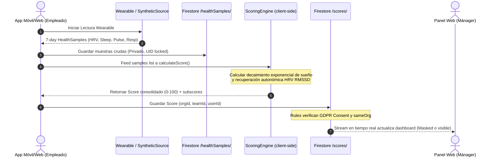
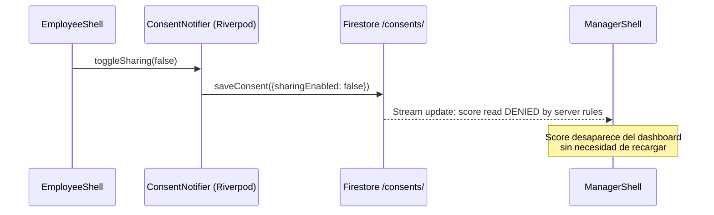

# Flujo de Datos Clínico Telemétrico

Este documento describe el pipeline de datos secuencial de **BurnoutMeter**, trazando las métricas fisiológicas desde señales crudas de wearable hasta alertas agregadas de manager.

**Última revisión:** Mayo 2026

---

## 🔄 Ingesta de Scoring End-to-End

El pipeline de scoring corre de forma reactiva, transformando series de tiempo multi-métrica en señales clínicas de estrés:



---

## 🚦 Etapas de Ingesta

### 1. Fuente de Señales Fisiológicas

**Fuente actual (MVP):** `SyntheticHealthDataSource`
- Genera samples de biometría determinísticos basados en el UID del usuario.
- Cada usuario obtiene valores ligeramente distintos (varianza por hash del UID).
- Tipos de datos generados: `hrv_rmssd`, `sleep_hours`, `heart_rate`, `respiratory_rate`.

**Almacenamiento:** Los samples generados se escriben en `/healthSamples/` con el UID del owner. Las reglas Firestore garantizan que solo el owner puede leer/escribir sus propios samples.

**Fuente de producción (planificada):** Implementación concreta de `HealthDataSource` que conecte con iOS HealthKit o Android Health Connect mediante platform channels, o con APIs OAuth 2.0 de Oura/Fitbit/Garmin para el target Web.

---

### 2. Proceso de Scoring Clínico

**Trigger:** Cuando el empleado hace click en **"Simular Lectura Wearable"** en `EmployeeShell`, o automáticamente al cargar el dashboard (`personalScoreProvider`).

**Flujo de `personalScoreProvider` (Riverpod FutureProvider):**
```
1. Recuperar membership → obtener orgId y teamId reales
2. Consultar /scores/ → intentar retornar el último score cacheado
3. Si no hay score previo:
   a. SyntheticHealthDataSource.fetchSamples(userId, start, end)
   b. healthRepo.saveSamples(samples) → escribe en /healthSamples/
   c. ScoringEngine.calculateScore(samples) → calcula 4 subscores + índice
   d. healthRepo.saveScore(score) → guarda en /scores/
4. Retornar score calculado
```

**Motor de Cálculo (`ScoringEngine`):**
- HRV RMSSD < 40ms → activación simpática crítica
- Sueño < 7.2h → decaimiento exponencial del score
- Índice final pondera: Estrés (40%) + Deuda de Recuperación (30%) + Deuda de Sueño (20%) + Carga Física (10%)

---

### 3. Agregación y Gates de Consentimiento

**Para el Manager:** `teamScoresProvider(teamId)` en Riverpod:
```
1. Verificar rol: solo manager/admin pueden ejecutar
2. Recuperar miembros del equipo vía membershipRepository.getTeamMemberships()
3. Para cada miembro:
   a. consentRepository.getConsent(userId) → verificar sharingEnabled
   b. Solo si sharingEnabled == true: cargar personalScoreProvider(userId)
4. Log de auditoría GDPR en /audit_logs/
5. Retornar lista filtrada de scores
```

**Verificación Firestore Rules:** Las reglas del servidor verifican independientemente:
- `hasSharingConsent(resource.data.userId)` → consent activo en Firestore
- `resource.data.teamId in getMembership().managedTeamIds` → el manager gestiona el equipo
- `sameOrg(resource.data.orgId)` → mismo tenant/organización

**Privacidad en tiempo real:** El stream `watchConsent()` en `ConsentNotifier` permite que el manager vea el score desaparecer del dashboard instantáneamente cuando el empleado revoca el consentimiento. No hay cache client-side que bypass esto: el servidor rechaza el read en tiempo real.

---

### 4. Telemetría de Acceso y Audit Trail

Cada vez que el manager carga los scores del equipo, `teamScoresProvider` escribe un `AuditLog` en Firestore:

```dart
AuditLog(
  id: uuid(),
  actorUserId: authState.userId,
  actorRole: 'manager',
  actionType: 'read_team_aggregates',
  orgId: authState.orgId,
  details: 'Queried aggregated scores for team $teamId. 
            Received $N of $total members (consent filtered).',
)
```

Las reglas de Firestore para `/audit_logs/` son write-once con verificación del actor, garantizando la integridad del log para auditorías GDPR externas.

---

## 🗄️ Colecciones Firestore Activas

| Colección | Propósito | Reglas de Acceso |
|---|---|---|
| `/memberships/{uid}` | RBAC: rol, orgId, teamId, managedTeamIds | Owner lee/crea(solo employee); Admin/Manager del mismo org puede leer |
| `/consents/{uid}` | GDPR consent: sharingEnabled, actionsEnabled | Solo owner write; Manager/Admin pueden leer |
| `/healthSamples/{sampleId}` | Biometría cruda (privada) | Solo owner read/write. Managers categóricamente bloqueados |
| `/scores/{scoreId}` | Burnout Index calculado | Owner siempre lee; Manager si consent+sameTeam+sameOrg; Admin si sameOrg |
| `/actions/{actionId}` | Intervenciones de bienestar | Manager/Admin crea si consent; Employee actualiza estado |
| `/audit_logs/{logId}` | GDPR audit trail (write-once) | Cualquier auth crea; Solo Admin del mismo org lee |
| `/seed_status/seeded` | Estado de siembra demo | Público (read/write sin auth — ⚠️ temporal) |

---

## ⚡ Flujo Reactivo: Consent en Tiempo Real


