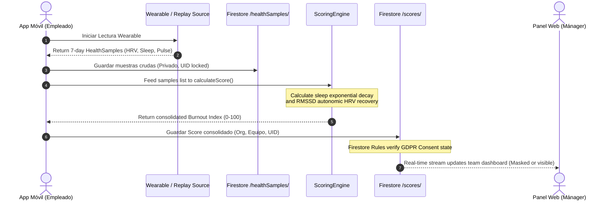

# Clinical Telemetry Data Flow

This document outlines the sequential data pipeline of **BurnoutMeter**, tracing physiological metrics from raw wearable signals to aggregated manager alerts.

---

## 🔄 End-to-End Scoring Ingestion

The scoring pipeline runs reactively, transforming multi-metric time series data into clinical stress signals:

---

## 🚦 Ingestion Stages

### 1. Ingestion of Physiological Signal Series
* **Source**: `ReplayHealthDataSource` reads clinical raw samples (heart rate averages, HRV RMSSD milliseconds, breathing rates, sleep durations).
* **Storage**: Ingested samples are written directly to `/healthSamples/`. Each document is bound to the owner's UID.

### 2. Clinical Scoring Process
* **Triggers**: When the employee clicks **"Simular Lectura Wearable"** in `EmployeeShell`.
* **Execution**: The `ScoringEngine` processes the sample lists:
  * HRV averages below 40ms are flagged as critical sympathetic activation.
  * Sleeping windows below 6.5 hours apply an exponential decay to the overall score.
  * The final index combines the factors (Stress, Recovery debt, Sleep debt, Physical load).

### 3. Aggregation and Consent Gates
* **Verification**: The Firestore Rules engine inspects `/scores/` reads requested by the manager's client:
  * If `sharingEnabled` is false, access is rejected immediately on the server.
  * If consent is active, the manager dashboard renders the daily index badge and fires a risk alarm if the score is greater than 70.
* **Telemetry**: Appends a secure log to `/audit_logs/` describing the read access.
