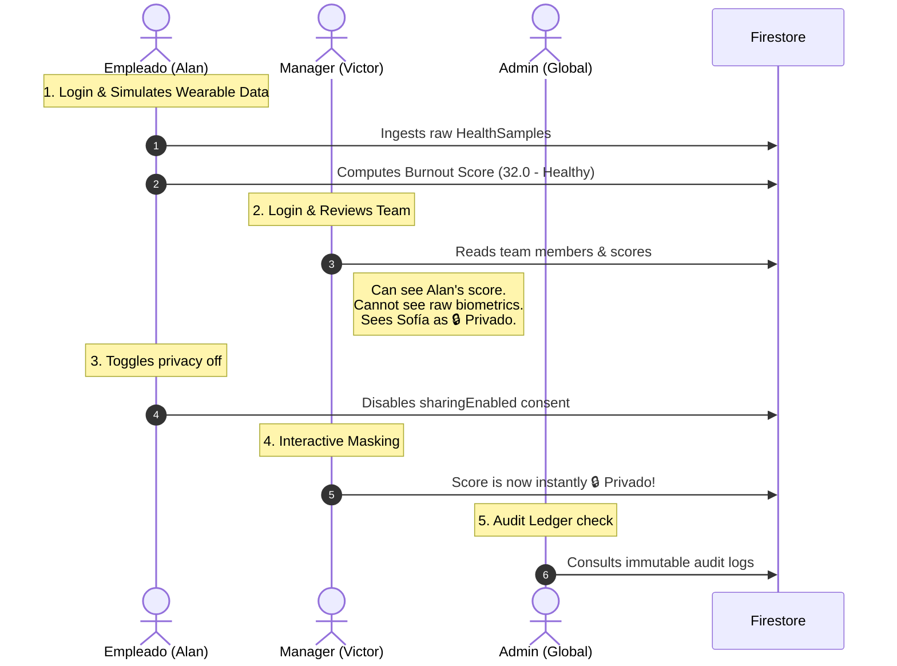

# 3-Minute Executive Demo Journey & Guide

This guide is designed for evaluators and technical leads (CTO/Architects) who want to experience the complete B2B Multi-Tenant, Privacy-by-Design, and immutable audit logs of BurnoutMeter in under 3 minutes.

---

## 🛠️ Step 1. Initialize & Start the Environment

Before starting the demo, ensure the local zero-trust sandbox is running:

### A. Launch Local Emulators
Start the secure local Firebase Emulator suite (Auth, Firestore, Consoles):
```bash
./scripts/run_emulators.sh
```

### B. Boot the BurnoutMeter Client
Run the application in your preferred environment (Web or Mobile):
*   **Web Target:** Runs as standard dev server.
*   **Visual Indicator:** Notice the bright global header connection badge showing either **`[EMULADOR LOCAL]`** (amber, runs isolated in your local sandbox) or **`[NUBE FIREBASE]`** (emerald, connects directly to production Google Cloud).

---

## 🌱 Step 2. One-Click Database Seeding

On the Login screen, click the **"Inicializar DB Local (Seed)"** button. Under the hood, this executes the idempotent Dart `SeedService`:
1. Creates the organization `org789`.
2. Seeds two teams (`teamEng` and `teamCS`).
3. Provisions Firebase Auth accounts with standard credentials.
4. Registers memberships and initial consent policies in Firestore.

*All seeded accounts use the standard password:* **`password123`**

---

## 👥 Step 3. The Multi-Role Interactive Demo Flow

Follow this structured journey to witness B2B multi-tenancy and the GDPR privacy enforcement in action:



### 👤 Role A. The Employee Journey (Alan)
1.  **Log in:** Use the quick login selector to choose **Alan** (`employee_eng1@burnoutmeter.demo`).
2.  **Dashboard:** Observe his personal Burnout Index (initially healthy, e.g. `32.0`). 
3.  **Physiological Simulation:** Click **"Simular Lectura Wearable"**.
    *   *What happens:* The app dynamically generates new randomized biometric records via the `SyntheticHealthDataSource` (sleep, HR, HRV, respiratory rate), calculates a new consolidated score using the `ScoringEngine`, and writes it to Firestore. The circular gauge animates reactively!
4.  **GDPR Consent Review:** Go to the "Privacidad" tab. Alan's sharing and action policies are currently **Active**.
5.  **Log out.**

### 👥 Role B. The Manager Journey (Victor)
1.  **Log in:** Choose **Victor** (`manager_eng@burnoutmeter.demo`). As Team Lead, he manages `teamEng`.
2.  **Team Dashboard:** Observe the aggregated team indicators:
    *   **Alan's Card:** Fully visible score (`32.0`) with physiological subscore breakdown charts.
    *   **Sofía's Card:** Displays **`🔒 Privado`** with no score number.
    *   *Why?* Sofía (`employee_eng2@burnoutmeter.demo`) has opted out of consent sharing. The server security rules physically prevent Victor's client from fetching her score document.
3.  **Wellness Intervention Action:**
    *   Click on **Alan's details** → **"Sugerir pausa breve"** → Confirm.
    *   *What happens:* The client writes a new wellness intervention to the `/actions` collection. The Firebase Cloud Function `sendActionNotification` triggers automatically and logs this intervention in the immutable audit log.
4.  **Log out.**

### 👤 Role C. GDPR Real-Time Privacy Enforcement
1.  **Log in:** Choose **Sofía** (`employee_eng2@burnoutmeter.demo`).
2.  **Consent Opt-in:** Go to the "Privacidad" tab. Toggle **"Compartir mi score con mi organización"** to **Active**.
3.  **Log out.**
4.  **Log in:** Choose **Victor** (`manager_eng@burnoutmeter.demo`).
5.  **Reactive Re-evaluation:** Sofía's burnout score is now **instantly visible** on Victor's team list, fully updating the charts and Aggregated Index!

### 🔑 Role D. The Global Admin & Security Auditing
1.  **Log in:** Choose the **Global Admin** (`admin@burnoutmeter.demo`).
2.  **Audit Ledger tab:** Review the immutable **Security Access Auditing Ledger**.
    *   *What happens:* Every single transaction, query, consent change, and manager access is printed on an immutable ledger. 
    *   *Backend Enforcement:* Try to update or delete any log. The server's Firestore rules throw a permission error. The ledger is write-once and permanent.
