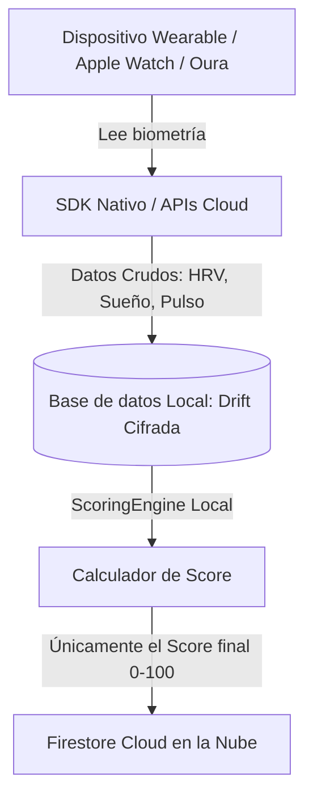
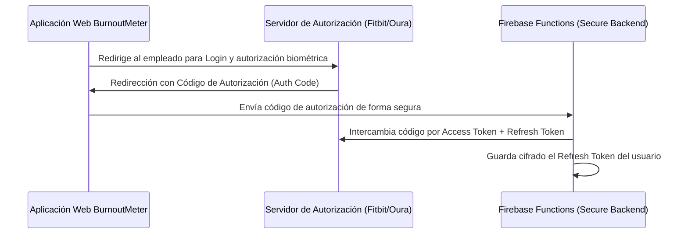

# Arquitectura de Integración de Salud: Wearables y Dispositivos de Salud

Este documento detalla la arquitectura técnica, las configuraciones de plataforma y las estrategias de ingesta para conectar dispositivos wearables (Apple Watch, Fitbit, Oura, Whoop, Garmin) a la plataforma **BurnoutMeter**.

Dado que BurnoutMeter es una plataforma multiplataforma (Web y Mobile), empleamos una estrategia híbrida: **Integración Nativa en Dispositivo (iOS/Android)** y **Integración Cloud-to-Cloud mediante OAuth 2.0**.

---

## 🏛️ Arquitectura General de Ingesta y Privacidad

Para garantizar el cumplimiento de la directiva **GDPR** y el principio de **Privacy-by-Design**, implementamos una segregación estricta de datos biológicos crudos en el flujo de ingesta:



1. **Datos Crudos Locales**: Los latidos milisegundo a milisegundo (HRV), ciclos de sueño y tasas respiratorias se almacenan estrictamente de forma local en el dispositivo del empleado utilizando una base de datos Drift cifrada (SQLite).
2. **Cálculo en Borde (Edge Computing)**: El `ScoringEngine` procesa la biometría localmente en el cliente para derivar el índice consolidado (0-100).
3. **Sincronización Cloud**: Solo se sincroniza a la base de datos Firestore Cloud el Score general y los cuatro subscores intermedios. Los datos crudos jamás viajan a los servidores corporativos, blindando la privacidad del empleado.

---

## 🍎 1. Integración Nativa en iOS: Apple HealthKit

En iOS, el sistema operativo unifica la información biométrica en el framework de **HealthKit**.

### A. Paquete Flutter Utilizado
Utilizamos el paquete `health` (ya presente en `pubspec.yaml`), el cual se comunica mediante canales de plataforma (`Platform Channels`) con la API nativa de Apple.

### B. Configuración de Entitlements en Xcode
Se requiere añadir la capacidad de HealthKit en el proyecto de Xcode:
- Habilitar `HealthKit` en la sección **Signing & Capabilities**.
- Para soporte continuo, activar la bandera **Background Delivery** (Lecturas en segundo plano programadas).

### C. Declaración de Permisos de Privacidad (`Info.plist`)
Deben agregarse obligatoriamente las siguientes cadenas descriptivas para el usuario:

```xml
<key>NSHealthShareUsageDescription</key>
<string>BurnoutMeter requiere acceso a tus datos de HRV, pulso cardíaco y sueño para calcular tu índice fisiológico de sobrecarga laboral de forma local.</string>
<key>NSHealthUpdateUsageDescription</key>
<string>BurnoutMeter escribe anotaciones básicas de bienestar sobre tus periodos de meditación guiada aceptados en tu aplicación de Salud.</string>
```

### D. Flujo de Permisos en Código
```dart
import 'package:health/health.dart';

Future<void> initializeHealthKit() async {
  final health = HealthFactory();
  final types = [
    HealthDataType.HRV_RMSSD,
    HealthDataType.SLEEP_IN_BED,
    HealthDataType.HEART_RATE,
    HealthDataType.RESPIRATORY_RATE,
  ];

  // Solicitar autorización de lectura
  bool requested = await health.requestAuthorization(types);
  if (requested) {
    // Ingestar datos biométricos de las últimas 24 horas a Drift local
  }
}
```

---

## 🤖 2. Integración Nativa en Android: Google Health Connect

Google ha reemplazado la API heredada de Google Fit por **Health Connect**, una pasarela segura y local integrada directamente a nivel de sistema operativo desde Android 14.

### A. Declaración de Permisos en el Manifiesto (`AndroidManifest.xml`)
Se deben declarar las actividades de Health Connect y las intenciones de lectura requeridas:

```xml
<manifest xmlns:android="http://schemas.android.com/apk/res/android">
  <uses-permission android:name="android.permission.health.READ_HEART_RATE"/>
  <uses-permission android:name="android.permission.health.READ_RESPIRATORY_RATE"/>
  <uses-permission android:name="android.permission.health.READ_SLEEP"/>

  <application>
    <!-- Actividad para gestionar los permisos de Health Connect -->
    <activity android:name=".PermissionsRationaleActivity" android:exported="true">
      <intent-filter>
        <action android:name="android.intent.action.VIEW_PERMISSION_USAGE"/>
        <category android:name="android.intent.category.DEFAULT"/>
      </intent-filter>
    </activity>
  </application>
</manifest>
```

---

## ☁️ 3. Integración Cloud-to-Cloud (Indispensable para Web)

Para usuarios que ejecutan BurnoutMeter en navegadores web (donde no existen APIs de hardware de salud nativas), o que utilizan wearables no vinculados al teléfono móvil (como anillos inteligentes Oura o pulseras Whoop), empleamos pasarelas OAuth 2.0 Web.

### A. Flujo de Onboarding OAuth 2.0



### B. Sincronización en Segundo Plano con Firebase Functions
Implementamos una función en Firebase Functions que se ejecuta de forma cronometrada (cada 3 horas) mediante Google Cloud Scheduler para ingestar las biometrías de forma automatizada sin necesidad de que el empleado abra la aplicación:

1. **Trigger Cron**: Ejecución automática.
2. **Secure Decryption**: La función lee de Firestore el `RefreshToken` cifrado del usuario.
3. **Token Refresh**: Solicita un nuevo `AccessToken` al proveedor (Ej: Oura API).
4. **API Request**: Consulta el endpoint REST, por ejemplo:
   `GET https://api.ouraring.com/v2/usercollection/sleep`
5. **Score Computation**: El motor de cálculo en la nube (`ScoringEngine` migrado a TypeScript/Node) ejecuta las ecuaciones de burnout y guarda el `Score` resultante de forma transaccional en la colección Firestore.
