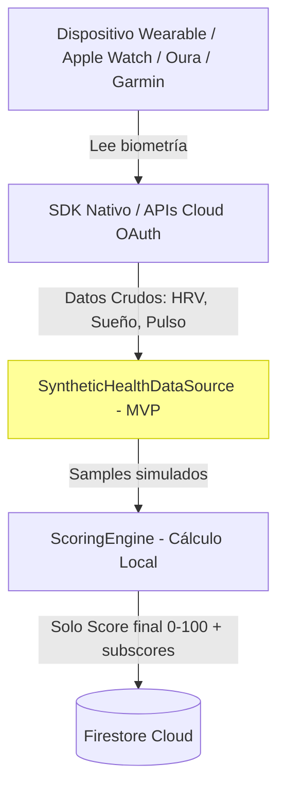
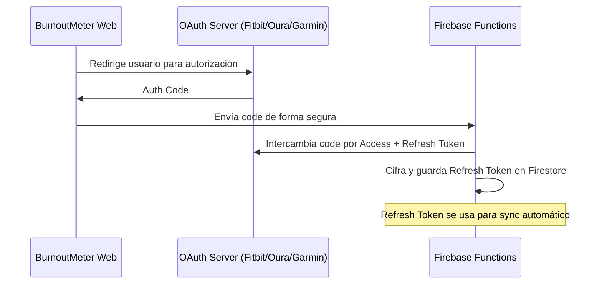

# Arquitectura de Integración de Salud: Wearables y Dispositivos de Salud

Este documento detalla la arquitectura técnica, las configuraciones de plataforma y las estrategias de ingesta para conectar dispositivos wearables a la plataforma **BurnoutMeter**.

Dado que BurnoutMeter es una plataforma multiplataforma (Web y Mobile), empleamos una estrategia híbrida: **Integración Nativa en Dispositivo (iOS/Android)** y **Integración Cloud-to-Cloud mediante OAuth 2.0**.

**Última revisión:** Mayo 2026

---

## 📍 Estado Actual de Integración (MVP)

**En el MVP actual**, la integración con wearables reales está **planificada pero no implementada**. El sistema usa `SyntheticHealthDataSource` como sustituto:

```dart
// lib/data/sources/health/synthetic_health_data_source.dart
class SyntheticHealthDataSource {
  Future<List<HealthSample>> fetchSamples({
    required String userId,
    required DateTime start,
    required DateTime end,
  }) async {
    // Genera biometría determinística basada en el hash del userId
    // HRV RMSSD, sleep_hours, heart_rate, respiratory_rate
    // Cada usuario obtiene valores ligeramente distintos (varianza por UID)
  }
}
```

La interfaz abstracta `HealthDataSource` en el dominio está diseñada para ser intercambiada sin modificar los providers o el engine:

```
lib/domain/repositories/health_repository.dart  ← interfaz abstracta
lib/data/repositories/firestore_repositories.dart  ← implementación Firestore
lib/data/sources/health/synthetic_health_data_source.dart  ← fuente sintética MVP
```

---

## 🏛️ Arquitectura General de Ingesta y Privacidad

Para garantizar el cumplimiento del **GDPR** y el principio de **Privacy-by-Design**, implementamos segregación estricta de datos biológicos crudos:



**Flujo de privacidad (objetivo de producción):**
1. **Datos Crudos Locales**: HRV ms a ms, ciclos de sueño y tasas respiratorias se almacenan estrictamente en el dispositivo local usando Drift (SQLite cifrado).
2. **Cálculo en Borde (Edge Computing)**: `ScoringEngine` procesa la biometría localmente.
3. **Sincronización Cloud**: Solo el Score general (0-100) y los cuatro subscores intermedios viajan a Firestore. Los datos crudos jamás alcanzan servidores corporativos.

---

## 🍎 1. Integración Nativa iOS: Apple HealthKit (Planificada)

En iOS, el sistema operativo unifica la información biométrica en el framework **HealthKit**.

### A. Paquete Flutter
Paquete recomendado: `health` (pub.dev) — comunica con HealthKit via Platform Channels.

**Nota**: Actualmente NO está en `pubspec.yaml`. Debe añadirse cuando se implemente la integración real.

### B. Configuración Xcode Requerida
- Habilitar `HealthKit` en **Signing & Capabilities**
- Activar **Background Delivery** para lecturas programadas en segundo plano

### C. Permisos de Privacidad (`Info.plist`)
```xml
<key>NSHealthShareUsageDescription</key>
<string>BurnoutMeter requiere acceso a tus datos de HRV, pulso cardíaco y sueño 
para calcular tu índice fisiológico de sobrecarga laboral de forma local.</string>
<key>NSHealthUpdateUsageDescription</key>
<string>BurnoutMeter escribe anotaciones básicas de bienestar sobre tus periodos 
de meditación guiada aceptados en tu aplicación de Salud.</string>
```

### D. Flujo de Permisos en Código (Referencia)
```dart
import 'package:health/health.dart';

Future<void> initializeHealthKit() async {
  final health = HealthFactory();
  final types = [
    HealthDataType.HRV_RMSSD,
    HealthDataType.SLEEP_IN_BED,
    HealthDataType.HEART_RATE,
    HealthDataType.RESPIRATORY_RATE,
  ];

  bool requested = await health.requestAuthorization(types);
  if (requested) {
    // Ingestar datos biométricos de los últimos 7 días
    final samples = await health.getHealthDataFromTypes(
      startTime: DateTime.now().subtract(const Duration(days: 7)),
      endTime: DateTime.now(),
      types: types,
    );
    // Mapear a HealthSample[] y guardar via healthRepositoryProvider
  }
}
```

### E. Estado del Podfile (Actual)
El `ios/Podfile` está configurado con `platform :ios, '13.0'`. Esta versión mínima es compatible con HealthKit. No se requieren cambios para la integración básica.

---

## 🤖 2. Integración Nativa Android: Google Health Connect (Planificada)

Google reemplazó Google Fit por **Health Connect** — pasarela segura integrada a nivel de OS desde Android 14.

### A. Permisos en `AndroidManifest.xml`
```xml
<manifest xmlns:android="http://schemas.android.com/apk/res/android">
  <uses-permission android:name="android.permission.health.READ_HEART_RATE"/>
  <uses-permission android:name="android.permission.health.READ_RESPIRATORY_RATE"/>
  <uses-permission android:name="android.permission.health.READ_SLEEP"/>

  <application>
    <activity android:name=".PermissionsRationaleActivity" android:exported="true">
      <intent-filter>
        <action android:name="android.intent.action.VIEW_PERMISSION_USAGE"/>
        <category android:name="android.intent.category.DEFAULT"/>
      </intent-filter>
    </activity>
  </application>
</manifest>
```

---

## ☁️ 3. Integración Cloud-to-Cloud (Web Target)

Para usuarios en navegadores web (sin acceso a hardware nativo) o wearables como Oura/Whoop/Garmin no vinculados al teléfono:

### A. Flujo OAuth 2.0



### B. Sincronización Automática (Cloud Scheduler)
Firebase Function cronometrada (cada 3 horas) via Google Cloud Scheduler:
1. **Trigger Cron**: Ejecución automática programada
2. **Token Refresh**: Lee Refresh Token cifrado de Firestore y obtiene nuevo Access Token
3. **API Request**: Consulta endpoints REST del proveedor (e.g., `GET https://api.ouraring.com/v2/usercollection/sleep`)
4. **Score Computation**: `ScoringEngine` migrado a TypeScript/Node ejecuta las ecuaciones
5. **Write transaccional**: Score guardado en Firestore con la identidad del empleado

---

## 🔌 4. API Endpoints de Referencia por Proveedor

| Proveedor | Endpoint HRV | Endpoint Sueño | Auth |
|---|---|---|---|
| **Oura Ring** | `GET /v2/usercollection/heartrate` | `GET /v2/usercollection/sleep` | OAuth 2.0 |
| **Fitbit** | `GET /1/user/-/hrv/date/{date}.json` | `GET /1.2/user/-/sleep/date/{date}.json` | OAuth 2.0 |
| **Garmin** | `GET /wellness-api/rest/dailies/{userId}` | `GET /wellness-api/rest/sleeps/{userId}` | OAuth 1.0a |
| **Apple HealthKit** | `HealthDataType.HRV_RMSSD` | `HealthDataType.SLEEP_IN_BED` | Platform Channel |
| **Google Health Connect** | `HeartRateRecord` | `SleepSessionRecord` | Platform Channel |
| **Whoop** | `GET /v1/cycle/{cycleId}/recovery` | `GET /v1/activity/sleep/{sleepId}` | OAuth 2.0 |

---

## 📦 5. Dependencias Requeridas (Producción)

Las siguientes dependencias deben añadirse a `pubspec.yaml` cuando se implemente la integración real:

```yaml
dependencies:
  # Wearable integration (nativa iOS/Android)
  health: ^10.2.0              # HealthKit + Health Connect bridge
  
  # Local encrypted storage for raw biometrics
  drift: ^2.19.1               # ya presente ✅
  sqlite3_flutter_libs: ^0.5.20  # ya presente ✅
  
  # OAuth 2.0 web flow
  flutter_appauth: ^8.0.0      # OAuth 2.0 authorization code flow
  
  # Encryption for tokens stored at rest  
  flutter_secure_storage: ^9.2.2  # Cifrado de tokens en Keychain/Keystore
```
