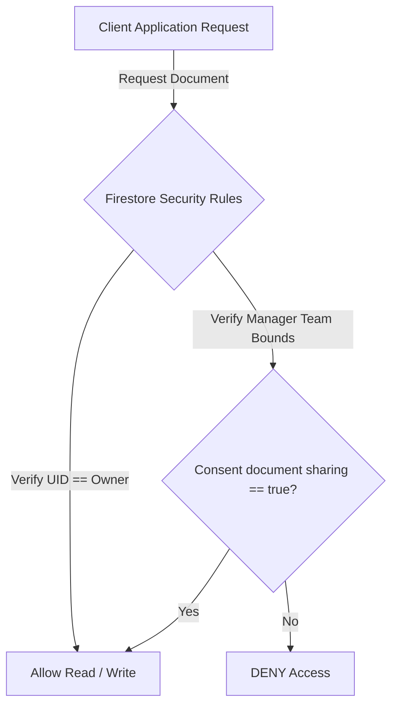

# Security Model & Privacy Architecture

**BurnoutMeter** prioritizes security and privacy-by-design. We implement clinical-grade data boundaries that comply with GDPR (European Union General Data Protection Regulation) and HIPAA privacy frameworks.

---

## 🔒 Multi-Tenant Firestore Rule Matrix

To prevent data leaks, we utilize strict security constraints written directly in `firestore.rules`. Permissions are verified dynamically on the server level:



### 1. Raw Biometrics Isolation (`/healthSamples/`)
* **Rule**: Raw health signals like heart rates or sleeping HRV values are strictly restricted to the user owning the device.
* **Security Enforcement**: 
  ```javascript
  match /healthSamples/{sampleId} {
    allow read: if request.auth != null && request.auth.uid == resource.data.userId;
    allow write: if request.auth != null && (
      (resource == null && request.auth.uid == request.resource.data.userId) ||
      (resource != null && request.auth.uid == resource.data.userId)
    );
  }
  ```
  *Managers can never read raw biometric metrics, preventing invasive corporate surveillance.*

### 2. GDPR Consent-Masked Scores (`/scores/`)
* **Rule**: Employees own their calculated Burnout Index. Managers can only read scores if **both** of the following conditions are met:
  1. The employee is inside the manager's assigned team (`managedTeamIds`).
  2. The employee has active consent sharing turned on (`sharingEnabled == true`).
* **Security Enforcement**:
  ```javascript
  match /scores/{scoreId} {
    allow read: if request.auth != null && (
      request.auth.uid == resource.data.userId || 
      (isManagerForTeam(request.auth.uid, resource.data.teamId) && isSharingConsentActive(resource.data.userId))
    );
  }
  ```

### 3. Immutable Security Ledger (`/audit_logs/`)
* **Rule**: Compliance logs are strictly "write-once". They can be appended, but never edited or deleted, ensuring they remain legally valid for external audits.
* **Security Enforcement**:
  ```javascript
  match /audit_logs/{logId} {
    allow create: if request.auth != null;
    allow read: if request.auth != null && getUserMembership(request.auth.uid).role == 'admin';
    allow update, delete: if false; // BLOCK ALL MUTATIONS
  }
  ```

---

## 🛡️ GDPR Privacy-by-Design Execution

1. **Instant Rights Revocation**: When the employee toggles "Compartir mi Burnout Index" to false inside `EmployeeShell`, the consent state updates in Firestore instantly. The change immediately blocks the manager's client from querying the score, demonstrating server-side security.
2. **Clinical Privacy Separation**: By calculating Burnout Indices from aggregated metrics and discarding raw biometrics in client-facing dashboards, we satisfy standard GDPR data minimization guidelines.
